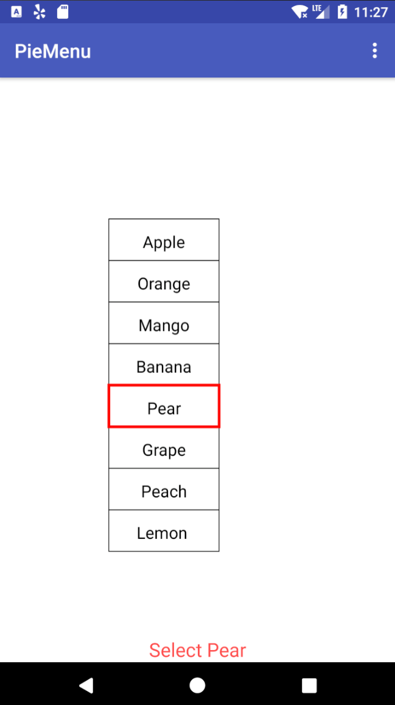

* TOC
{:toc}

# Menu Experiment Assignment

**Objective**: Build an end-to-end application. Interact with users.

**HCI Goals**:
- Build an application based on specs
- Record user study data
- Produce plausible experiment results (within expected ranges)
- Understand marking menus

**Android Goals**:
- Implement menus
- Store data in file system

**Assigned Date**: ???, 2019

**Due Date**: ???, 2019

# Part 1

Tasks:
- Read the paper of this user study
- Understand sample code to set up condition of experiments

Please read [An Empirical Comparison of Pie vs. Linear Menus](https://medium.com/@donhopkins/an-empirical-comparison-of-pie-vs-linear-menus-466c6fdbba4b) to better understand the purpose and procedures in this user study.

In `MainActivity.java`, please understand `createExperimentSetupList()` method which sets up conditions for whole experiment.

An experiment has 6 sessions (2 menu types * 3 task types), and each session has 5 tasks.

For each session:
- Create one type of menu (linear/pie) based on current experiment condition.
- Create 5 tasks in the same type based on current experiment condition.
  - We already provide 5 sets of options for each task type (linear/pie/unclass).
For each task:
- Show 8 options in the menu based on the task type (linear/pie/unclass)
- Record the selected option

{:width="250px"}

For example, in the first session, the condition may be `linear task` in `pie menu`. For each of the 5 tasks in that session:
- When participant presses on the screen, a pie menu should show up as the screenshot above, with 8 task options in linear order (e.g., 1st/2nd/3rd/4th/5th/6th/7th/8th).
- The instruction text will prompt participant to select one option (e.g., 300).
- When participant moves finger on an option and release the finger, an option is selected
  - The participant may select the prompted option, or they may select another option by mistake.

Once the participant selects an option, they complete a `task`, and you should record these info in a `TaskObj` object:
- `selectedOptionIndex`: The index of selected option
- `startTime`: The timestamp when finger presses on the screen to show the menu
- `taskDurationMillSec`: The duration (in millsec) between finger presses down and leaves screen
- `startPoint`: The point on screen where finger presses down
- `endPoint`: The point on screen where finger leaves screen

In addition, for each task, you already have these info in an `ExperimentSetupObj` object:
- `sessionId`: 0-5
- `taskId`: 0-4
- `menuType`: Linear/pie
- `taskType`: Linear/pie/unclass
- `promptedOptionIndex`: The index of prompted option
- `optionList`: A list of 8 options' text

In part 3, you will analyze these recorded data.


# Part 2

Tasks:
- Extend class LinearMenuView and class PieMenuView from the abstract class CustomMenuView
- Handle input events on menus
- Update visual output of menus
- Record user study data

Please read the abstract class CustomMenuView we provide in code stub. You will extend this class to create your linear menu and pie menu.

For both menus, you should handle input events in `onTouchEvent()` method. In specific:
- ACTION_DOWN: Draw the menu view and record start information.
- ACTION_MOVE: Highlight the option closest to finger.
- ACTION_UP: Clear the menu view and record end information.

For both menus, you should update visual output (menu layout) in `onDraw()` method, based on the input events above. In specific:
- ACTION_DOWN:
  - Draw cell for each option.
  - Draw text on cell of linear menu.
- ACTION_MOVE:
  - Draw cell for each option.
  - Draw text on cell of linear menu.
  - Highlight the cell that finger moves in.
- ACTION_UP:
  - Clear canvas.

{:width="250px"}
{:width="250px"}

# Part 3

Tasks:
- Conduct user study
- Analyze recorded data

You will recruit 3 students and conduct this user study (6 session * 5 task) with each of them.

Make sure to consent them (and turn in your consent form)

After each user study, please export the recorded data. You will be asked to turn in these recorded data. If you are using emulator, you can use this command to pull data to your computer. <span style="color:red">TODO: Update path to pull data from Android phones.</span>
```bash
adb pull /storage/emulated/0/CSE340_PieMenu/Test.csv YOUR_COMPUTER_LOCAL_PATH
```

Then, please follow Results And Discussion in [An Empirical Comparison of Pie vs. Linear Menus](https://medium.com/@donhopkins/an-empirical-comparison-of-pie-vs-linear-menus-466c6fdbba4b) to analyze your recorded data.
- Target location (x) vs. seek time (y) in seconds
- Target location (x) vs. number of errors (y)

You will be asked to upload your plots with a paragraph of explanation to canvas.
- Please export your plots as images (taking screenshot is fine)
- Please explain your result and your procedure in the study.

# Turnin
## Submission Instructions

Please turn in your files in the following zip structure:

```bash
YOUR_STUDENT_ID.zip
├── LinearMenuView.java
├── PieMenuView.java
└── MainActivity.java
├── MainActivity.java
├── Result_0.csv
└── Result_1.csv
└── Signed consent forms (images/scans)
└── Summary of results.pdf
```

## Grading (10pts)

- Part 2
  - Linear menu works: 2pt
  - Pie menu works: 2pt
  - Correctly record data: 1pt
- Part 1 and 3
  - Have reasonable CSV output and charts: 1pt
  - Explanation:
    - Description of study process: 1pt
    - Demonstrate understanding of chart results: 1pt
    - Draw appropriate conclusions about linear vs. pie menu: 1pt
- Turn-in and compiles: 1pt
