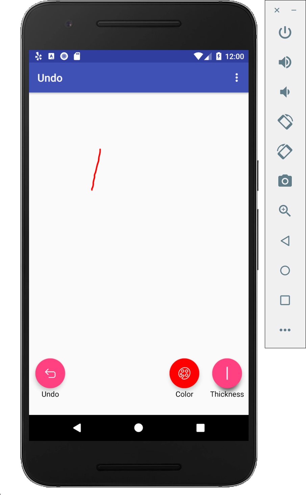

* TOC
{:toc}

# Undo Assignment

**Objective**: Understand Undo Abstractions.

**HCI Goals**:
- Make an accessible app
- Use heuristic evaluation to assess an app
- Build an app that does not have severe usability issues

**Android Goals**:
- Build an application based on specs
- Create Command objects
- Separation of concerns
- Event handlers


**Assigned Date**: ???, 2019

**Due Date**: ???, 2019

Tasks:
- Create a basic drawing app
- Support different color and thickness
- Handle undo/redo operations

You can create a basic drawing app from our code stub.
- Handle input events (ACTION_DOWN/ACTION_MOVE/ACTION_UP) to create drawing paths.
- Draw all paths in onDraw method.
  - See its behavior in screenshot 1 and 2.

You will then create Floating Action Buttons (FABs) to support changing color and thickness of drawing. After clicking FAB:
- Create a view to support selecting color (optional but recommended: use color picker you implemented in previous exercise).
  - See its behavior in screenshot 3 and 4.
- Create a view to support selecting thickness.
  - See its behavior in screenshot 5 and 6.

Most importantly, you should handle undo/redo operations.
- Show undo FAB if there is any command to undo.
  - See its behavior in screenshot 6 and 7.
  - Click to undo the previous command.
  - Long press to open a dialog and show recent commands (up to 10) to undo.
    - Click a command to set canvas to that stage.
- Show redo FAB if there is any command to redo.
  - See its behavior in screenshot 7 and 8.
  - Click to redo the next command.
  - Long press to open a dialog and show recent commands (up to 10) to redo.
    - Click a command to set canvas to that stage.
- We would like to limit the number of commands we can undo/redo, just like most of apps do (e.g., PhotoShop). Please store up to 10 commands to undo and up to 10 commands to redo.

For FAB states:
- When there is no command to undo, hide undo FAB.
- When there is no command to redo, hide redo FAB.
- When a color is picked, the color FAB should update its background to that color.
- When a thickness is picked, the thickness FAB should update the thickness icon.
- You may need update color/thickness FAB state after undo/redo.

Important: a command contains one of these information (not only path). You will use three classes extended from astract Command class.
- Draw a path
- Change color
- Change thickness

After applying each command, a new CanvasState is created. Each CanvasState stores all commands needed to generate the current canvas.

A CanvasStateManager will keep track of all CanvasState.
- When a new command is applied, it will create a new CanvasState. Then it will update undoStack, redoStack, and currentCanvasState.
- When undo/redo, it will update undoStack, redoStack, and currentCanvasState.


{:width="200px"}
{:width="200px"}
{:width="200px"}
{:width="200px"}
{:width="200px"}
{:width="200px"}
{:width="200px"}
{:width="200px"}


Peer grading

3 students?

Heuristic evaluation

The Task:
- Step 1: draw something
- Step 2: undo
- Step 3: use menu to change color
- Step 4: try to redo
- Step 4: draw something
- Step 5: use new feature
- Step 6: undo and redo

Pick 3 most severe issues in all steps: Title + Screenshot + Pick one or more heuristics + severity rating + description

Feedback of their customized command

The current menu icon sizes are too small, already an usability issue. Just keep it.


# Turnin
## Submission Instructions

Please turn in your files in the following zip structure:

```bash
YOUR_STUDENT_ID.zip
├── CanvasState.java
├── CanvasStateManager.java
├── DrawingView.java
└── MainActivity.java
```


## Grading (10pts)

- Part 1: Implementation
  - Accessible app: 1pt
  - Undo and redo works in general: 1pt
  - Edge cases in undo/redo works: 1pt
  - Changing color works: 1pt
  - Changing thickness works: 1pt

- Part 2: Peer grading
  - Support one additional command: 1pt
  - Complete heuristic evaluation for other students: 2pt
  - No severe usability issues: 1pt
- Turn-in and compiles: 1pt
