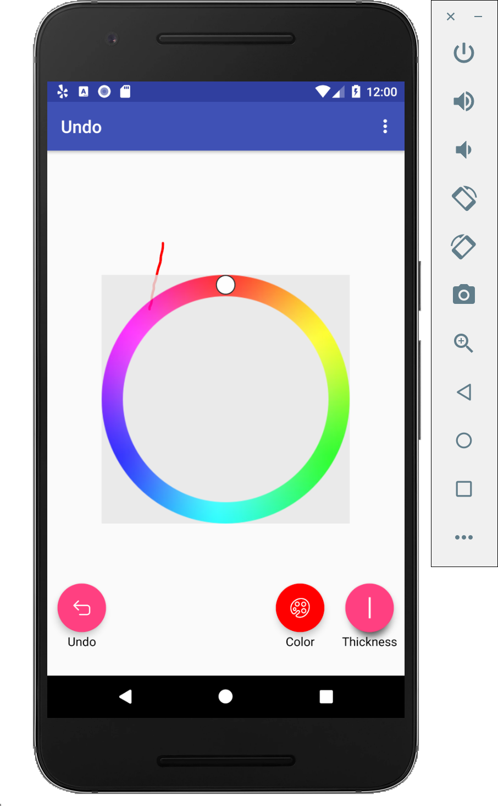
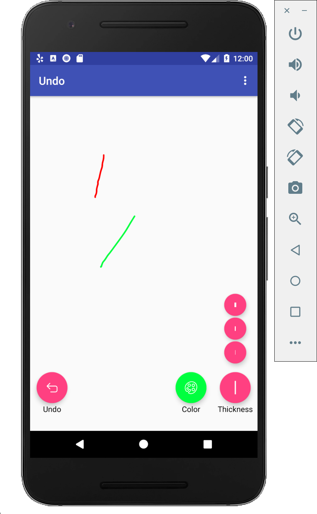

- TOC
{:toc}

Tasks:
- Create a basic drawing app
- Support different color and thickness
- Handle undo/redo operations

# Implementing drawing

First you will implement the basic drawing app from our code stubs in `DrawingView.java`.

```java
public boolean onTouch(View arg0, MotionEvent event);
```

Notice that the above method calls different functions `onDrawStart(...)`, `onDrawMove(...)`, and `onDrawEnd()` depending on the type of input action taken. Implement these functions. They build the path that the user creates via touch input.

*Related API*:
[Path](https://developer.android.com/reference/android/graphics/Path)

Then implement `onDraw(Canvas canvas)`. Think about when this function would and should be called.

For examples of how this should look, look at screenshots 1 and 2 below.

# Undo/Redo Operations
## Changing Color/Thickness Floating Action Buttons (FABs)
Create FABs to support changing color and thickness of drawing.

When you click the FAB to select color, create a view that allows
the user to select the color. It recommended that you leverage the
`ColorPicker` you have already implemented. For an example of how this
can look, look at screenshots 3 and 4.

When you click the FAB to select the stroke thickness, the user should be
able to decide between three thicknesses (each with their own FAB). For
an example of how this should look, look at screenshots 5 and 6.

## Expected Behavior
Show the undo FAB if and only if there is any command to undo. See the behavior in screenshots 6 and 7 for an example of what happens when
the undo FAB is clicked. On a long press of the undo button, a list of
recent commands (up to 10) is displayed. Clicking a command should undo all actions up to and including the selected action.

Show the redo FAB if and only if there is any command to redo. See the behavior in screenshots 7 and 8 for an example of what happens when the
redo FAB is clicked. On a long press of the redo button, a list of recent commands (up to 10) is displayed. Clicking a command should redo all actions up to and including the selected action.

There should be a limit on how many actions one can undo or redo. You should only allow up to 10 commands to undo and up to 10 commands to redo.

### FAB States
 - When there is no command to undo, the undo FAB should not be visible.
 - When there is no command to redo, the redo FAB should not be visible.
 - As a color is selected and after the color is selected, the color FAB
 should update its background to that color.
 - When a thickness is picked, the thickness FAB should update its icon
 to indicate the thickness selected.

# Canvas State
## Commands
There are three types of Commands. Each of these commands are extended from the Command abstract class.

- `CommandChangeColor`
- `CommandChangeThickness`
- `CommandDrawPath`

## Designing the Canvas State
Implement the constructor for the CanvasState. A CanvasState stores
all the commands needed to generate the current canvas.

Then implement `drawCanvas(Canvas canvas)`. This function will apply
the commands that a CanvasState is comprised of to draw on the canvas.

## Managing Different CanvasStates with a CanvasStateManager
The CanvasStateManager will handle moving back and forth between `CanvasState`s as the user undoes, redoes, or applies actions. The
`DrawingView` instance has a `CanvasStateManager.`

`getUndoHistory()` and `getRedoHistory()` returns an array of the descriptors for the commands one can undo and redo respectively.

`applyNewCommand(Command command)` will apply a new Command. This entails
creating a new CanvasState accounting for the command and updating
the `currentCanvasState`, `undoStack`, and `redoStack`.

`undo()` and `redo` apply an undo and redo respectively to the `CanvasStateManager`. This entails
updating the `currentCanvasState`, `undoStack`, and `redoStack`.

## Screenshots of the user experience

{:width="200px"}
{:width="200px"}
{:width="200px"}
{:width="200px"}
{:width="200px"}
{:width="200px"}
{:width="200px"}
{:width="200px"}


Peer grading

3 students?

Heuristic evaluation

The Task:
- Step 1: draw something
- Step 2: undo
- Step 3: use menu to change color
- Step 4: try to redo
- Step 4: draw something
- Step 5: use new feature
- Step 6: undo and redo

Pick 3 most severe issues in all steps: Title + Screenshot + Pick one or more heuristics + severity rating + description

Feedback of their customized command

The current menu icon sizes are too small, already an usability issue. Just keep it.


# Turn-in

## Submission Instructions

You will turn in the following files <a href="javascript:alert('Turn-in link pending assignment release');">here</a>:

```
- CanvasState.java
- CanvasStateManager.java
- DrawingView.java
- MainActivity.java
```

## Grading (10pts)

- Part 1: Implementation
  - Accessible app: 1pt
  - Undo and redo works in general: 1pt
  - Edge cases in undo/redo works: 1pt
  - Changing color works: 1pt
  - Changing thickness works: 1pt
- Part 2: Peer grading
  - Support one additional command: 1pt
  - Complete heuristic evaluation for other students: 2pt
  - No severe usability issues: 1pt
- Turn-in and compiles: 1pt
